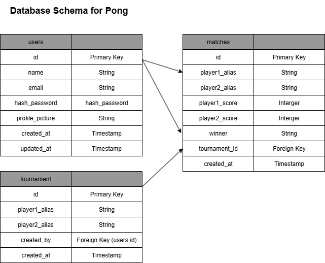

# ft-transcendence

Notion - https://www.notion.so/FT-Transcendence-22620305a78e806693c1c70ff49169ec

FrontEnd
- cd website
- npm install
- npm run dev

Game
- Go to http://localhost:5173/play
- Fill Quickplay form and click Start to run
- Use w/s and up/down arrows to move paddles.
- To change Paddle speed:
    - Go to Paddle.ts and change speed value
- To change ball speed:
    - Go to Ball.ts and change velocity values in constructor

Backend
- docker build -t pong-backend .
- docker run --name backend -p 3000:3000 pong-backend
- http://localhost:3000/api/

SQLite Commands
- .tables
- .schema users
- SELECT * FROM users;
.help

Stop and remove container
- docker stop $(docker ps -qa); docker rm $(docker ps -qa); docker rmi -f $(docker images -qa); docker volume rm $(docker volume ls -q); docker network rm $(docker network ls -q) 2>/dev/null

How to test backend
1. Signup Via Thunderclient
- POST http://localhost:3000/api/signup
- Headers Content-Type: application/json
- Body name, email, password

2. Login via Thunderclient
- POST http://localhost:3000/api/login
- Headers Content-Type: application/json
- Body email, password

3. Get User Info via Thunderclient
- GET http://localhost:3000/api/profile
- set cookie, access-token=JWT_TOKEN
- return id, name and email
- If remove the token, this route cannot be accessed

4.
 

Google Sign in
- turn on both backend and frontend with npm run dev
- Go to incognito mode in browser, http://localhost:5173/signup
- Follow the instructions to login and redirect to home page
- Check if cookie is set as access_token.
- The access token allows access into protected routes.

