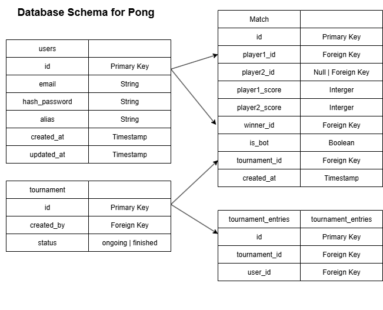

# ft-transcendence

Notion - https://www.notion.so/FT-Transcendence-22620305a78e806693c1c70ff49169ec

FrontEnd
- cd website
- npm install
- npm run dev

Backend
- docker build -t pong-backend .
- docker run --name backend -p 3000:3000 pong-backend
- curl or visit http://localhost:3000/api/hello

SQLite Commands
- .tables
- .schema users
- SELECT * FROM users;
.help

Stop and remove container
- docker stop $(docker ps -qa); docker rm $(docker ps -qa); docker rmi -f $(docker images -qa); docker volume rm $(docker volume ls -q); docker network rm $(docker network ls -q) 2>/dev/null

How to test backend
1. Signup Via Thunderclient
- POST http://localhost:3000/api/signup
- Headers Content-Type: application/json
- Body username, email, password

2. Login via Thunderclient
- POST http://localhost:3000/api/login
- Headers Content-Type: application/json
- Body email, password

 

