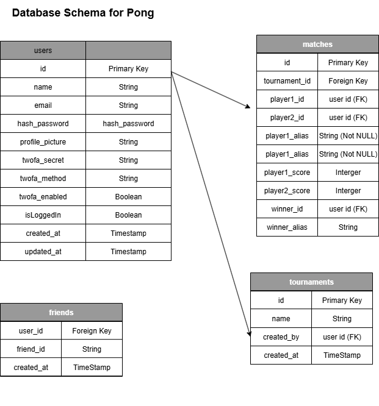

# ft-transcendence

Notion - https://www.notion.so/FT-Transcendence-22620305a78e806693c1c70ff49169ec

**Instructions on how to run**
1. Clone this repo to your local drive
2. Run the makefile to build the docker containers
3. Go to https://pong.42.fr

## Technologies Used
Frontend
1. NodeJS
2. Typescript
3. Tailwind

Backend
1. SQLite for Database
2. Fastify for Server
3. Typescript
4. Ajv for Schema

## Modules Done
1. Major module: Use a framework to build the backend.
2. Minor module: Use a framework or toolkit to build the front-end.
3. Minor module: Use a database for the backend -and more.
4. Major module: Standard user management, authentication and users across tournaments.
5. Major module: Implement remote authentication.
6. Major module: Remote players
7. Major module: Implement Two-Factor Authentication (2FA) and JWT.
8. Minor module: User and Game Stats Dashboards.
9. Minor module: Expanding Browser Compatibility.
